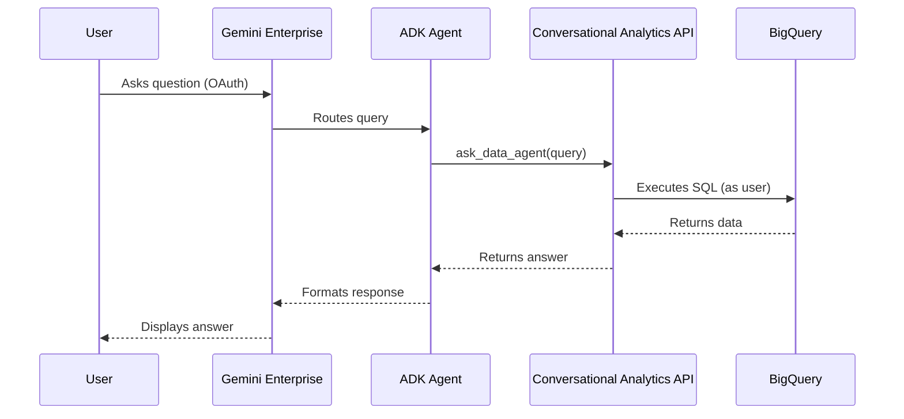

# Generic Setup Instructions for GE-BigQuery Integration


## Overview

This integration connects a **Gemini Enterprise Engine** with a **ADK Agent** running on Vertex AI Agent Engine, that interfaces with BigQuery via the **Conversational Analytics API**. It uses **OAuth 2.0** to ensure that queries from GE down to BigQuery respect the identity of the user making the query.

## Architecture


**Key Feature:** OAuth identity passthrough ensures queries execute with the end user's BigQuery permissions.

## Prerequisites

1.  **Google Cloud Project**: An active Google Cloud project with billing enabled.
2.  **APIs Enabled**: Ensure the following APIs are enabled in your project:
    *   Vertex AI API (`aiplatform.googleapis.com`)
    *   Vertex AI Search and Conversation API (`discoveryengine.googleapis.com`)
    *   BigQuery API (`bigquery.googleapis.com`)
    *   Cloud Storage API (`storage.googleapis.com`)
    *   Gemini Data Analytics API (`geminidataanalytics.googleapis.com`)
    *   Gemini Enterprise API (`cloudaicompanion.googleapis.com`)
3.  **Gemini Enterprise Deployed**: Ensure that Gemini Enterprise has been deployed and is available in your organization/project.
4.  **BigQuery Tables**: The tables (e.g., `project.dataset.table`) you want to query.
5.  **Local Environment**: Python 3.11+ installed.

### Required Permissions

For a minimum privilege setup, ensure the user or service account executing these steps has the following permissions (or equivalent custom roles):

*   **Gemini Enterprise & Deep Research**: `cloudaicompanion.companions.generate*`, `cloudaicompanion.entitlements.get`, `cloudaicompanion.topics.create`.
*   **Vertex AI Search & Data Agents**: All `discoveryengine.*` admin permissions (or `CustomDiscoveryEngineAdmin`), and `geminidataanalytics.dataAgents.*`.
*   **Agent Deployment**: `aiplatform.reasoningEngines.*`, `storage.buckets.*`, `storage.objects.*` (for staging artifacts).
*   **OAuth Configuration**: `clientauthconfig.clients.*`, `clientauthconfig.brands.*`, `oauthconfig.testusers.*`, `oauthconfig.verification.*`.
*   **BigQuery**: `bigquery.datasets.get`, `bigquery.tables.get/list/getData`, `bigquery.jobs.create` (for querying and ingestion).
*   **IAM**: `iam.serviceAccounts.list`, `iam.serviceAccounts.actAs` (granted on the Agent Service Account if applicable).
*   **General**: `resourcemanager.projects.get/list`, `roles/serviceusage.serviceUsageConsumer`.

## Step 1: Configure Local Environment

1.  Clone this repository to your local machine.
2.  Navigate to the repository directory.
3.  Create a virtual environment:
    ```bash
    python3 -m venv .venv
    source .venv/bin/activate
    ```
4.  Install dependencies:
    ```bash
    pip install python-dotenv google-cloud-aiplatform google-cloud-discoveryengine requests
    ```
    *(Note: If using `uv`, you can run `uv pip install` with the same packages instead).*

5.  Create and populate a `.env` file in the root directory:
    ```properties
    # Google Cloud Configuration
    GOOGLE_CLOUD_PROJECT_ID=your-project-id # The ID of your Google Cloud project
    GOOGLE_CLOUD_PROJECT_NUMBER=your-project-number # The number of your Google Cloud project
    GOOGLE_CLOUD_LOCATION=global # The location for the agent (default: global)
    GOOGLE_CLOUD_REGION=us-central1 # The region for deployment (default: us-central1)

    # Vertex AI Search & Conversation (Discovery Engine)
    GEMINI_APP_ID=your-gemini-enterprise-engine-id # The ID of the Gemini Enterprise engine (Used in Step 7)

    # BigQuery Analytics Agent (ADK)
    BIGQUERY_DATA_AGENT_ID=your-agent-id # An arbitrary ID for the data agent (e.g., my_data_agent) (Used in Step 3)
    MODEL_NAME=gemini-2.5-flash # The model to use (default: gemini-2.5-flash)

    # BigQuery Data
    # Comma-separated list of full table IDs (project.dataset.table or dataset.table)
    BIGQUERY_TABLE_IDS=project.dataset.table1,project.dataset.table2 # Tables the agent can query (Used in Step 3)

    # OAuth 2.0 Credentials (Required for identity passthrough)
    OAUTH_CLIENT_ID=your-oauth-client-id # OAuth 2.0 Client ID (Used in Steps 4, 6)
    OAUTH_CLIENT_SECRET=your-oauth-client-secret # OAuth 2.0 Client Secret (Used in Steps 4, 6)

    # Authorization Resource Name (Arbitrary name for the auth bridge)
    AUTH_RESOURCE_ID=your-auth-resource-id # An arbitrary name for the authorization resource (Used in Steps 6, 7)

    # Reasoning Engine (Optional, used if you want to reuse an existing deployment)
    # ORDERS_REASONING_ENGINE_ID=projects/your-project/locations/us-central1/reasoningEngines/your-engine-id
    ```

## Step 2: Authenticate gcloud

Ensure your local `gcloud` CLI is authenticated and pointing to the correct project.

```bash
gcloud auth login
gcloud config set project your-project-id
gcloud auth application-default login
```

## Step 3: Create Data Agent

Create the BigQuery Data Agent. This agent will handle the actual data retrieval from BigQuery.

```bash
python scripts/admin_tools.py
```

**IMPORTANT**: Ensure your `.env` file has `BIGQUERY_TABLE_IDS` set before running this script.

## Step 4: Deploy the ADK Agent

Deploy the ADK Agent (Reasoning Engine) to Vertex AI Agent Engine.

The code in `app/bq_caapi_wrapper_agent/agent.py` defines this agent using the **Google ADK Framework**. Its purpose is to:
1.  **Bridge Authentication**: It uses a callback (`bridge_oauth_token`) to pass the OAuth access token from Gemini Enterprise to the BigQuery Data Agent toolset.
2.  **Wraps Conversational Analytics API**: It uses the `DataAgentToolset` from the ADK to interact with the BigQuery Data Agent (created in Step 3), allowing it to query BigQuery securely.

Run the deployment script:

```bash
# Please review app/bq_caapi_wrapper_agent/agent.py, no need to change anything if you have populated the .env file correctly

# Run the deployment script:
bash scripts/deploy_agents.sh
```

**CRITICAL**: Note the **Reasoning Engine Resource Name** from the output. It looks like: `projects/.../locations/us-central1/reasoningEngines/...`.

## Step 5: Create OAuth 2.0 Credentials (UI Steps)

To enable identity passthrough, you must create an OAuth 2.0 Client ID. This step can be done at any time before Step 6.

1.  In the Google Cloud Console, navigate to **APIs & Services > Credentials**.
2.  Click **Create Credentials** and select **OAuth client ID**.
3.  For **Application type**, select **Web application**.
4.  Enter a **Name** (e.g., `GE-BQ-Integration`).
5.  Under **Authorized redirect URIs**, add:
    `https://vertexaisearch.cloud.google.com/oauth-redirect`
6.  Click **Create**.
7.  **IMPORTANT**: Download the JSON file or copy the **Client ID** and **Client Secret**.
8.  **Action**: Go back to your `.env` file and update `OAUTH_CLIENT_ID` and `OAUTH_CLIENT_SECRET`.

## Step 6: Create OAuth Authorization Resource

This step registers your OAuth credentials (Client ID/Secret) with Gemini Enterprise.

```bash
python scripts/setup_auth.py
```

## Step 7: Register Agent with Gemini Enterprise

Find your `GEMINI_APP_ID` if you don't have it. You can list available engines:

```bash
python scripts/list_engines.py
```

**Action**: Update your `.env` file with the found `GEMINI_APP_ID`.

Run the registration script with the **Reasoning Engine Resource Name** from Step 4:

```bash
python scripts/register_agents.py --resource <REASONING_ENGINE_RESOURCE_NAME>
```

## Step 8: Verification

Verify that the agent is successfully registered and enabled:

```bash
# Verify using a simple GET request (replace values)
python scripts/verify_registration.py
```

The output should show `state: ENABLED`.

## Using the Agent

Users can now interact with the agent via the Gemini Enterprise UI. Their queries will be authorized using the OAuth flow, ensuring security and identity passthrough to BigQuery.
